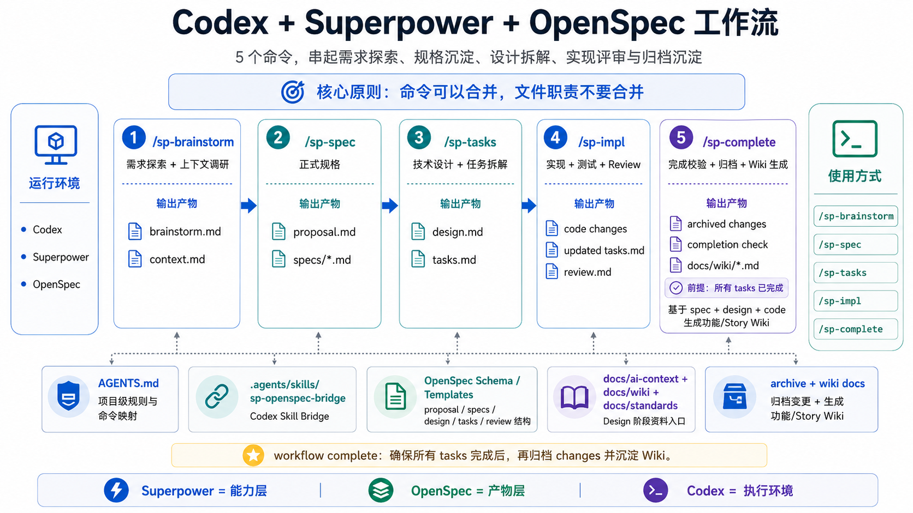

# Codex Superpower OpenSpec Workflow Template

语言：中文 | [English](README.en.md)

这是一个面向 Codex 或其他支持 skills 的 AI 编码代理的项目工作流模板，用来把 Superpower 风格的研发纪律、OpenSpec 风格的需求规格、项目规则、代码实现、测试、Review 和 Wiki 归档串成一个可重复执行的流程。

这个仓库本身不是业务项目，而是模板仓库。正常使用时，把 `templates/` 目录复制到目标项目根目录，再把 `skills/` 目录中的 `/sp-*` workflow skills 同步到用户级 skills 目录。复制完成后，目标项目就可以直接使用 `/sp-brainstorm`、`/sp-spec`、`/sp-tasks`、`/sp-impl`、`/sp-complete` 完成从需求澄清到实现归档的完整流程。

本流程不要求安装 OpenSpec CLI。AI 编码代理直接读取、生成、校验和归档 `openspec/` 下的文件。

## 前置要求

1. 必须安装 Superpower，并确认当前使用的代理或运行环境能访问 Superpower 的 brainstorm、review、verification 等 skills。
2. 必须同步本仓库 `skills/` 下的 `/sp-*` workflow skills 到用户级 skills 目录。
3. 目标项目必须包含从 `templates/` 复制过去的 `AGENTS.md`、`openspec/` 和 `docs/`。
4. 不需要安装 OpenSpec CLI。

## 架构图



## 这个项目解决什么问题

传统的 AI 编码容易跳过需求澄清、设计、任务拆分、测试证据和 Review 证据。本模板把这些动作文件化：

- 用 `openspec/changes/<change-id>/brainstorm.md` 和 `context.md` 保存需求探索和上下文。
- 用 `proposal.md` 和 `specs/<capability>/spec.md` 保存正式需求规格。
- 用 `design.md` 和 `tasks.md` 保存技术设计、代码路径、数据库/API/异步/测试计划。
- 用 `task-reviews.md` 和 `review.md` 保存每个任务的对齐 Review、安全 Review 和最终实现 Review。
- 用 `docs/wiki/<feature-or-story-title>.md` 保存功能完成后的可读 Wiki。
- 用 `docs/rules/*.md` 保存项目级业务规范、代码规范、配置规范和测试规范。

目标是让 Codex 在不同项目中按照同一套流程工作，但规则仍然可以由每个项目自行调整。

## 仓库结构

```text
sp-openspec/
  skills/
    sp-brainstorm/
    sp-spec/
    sp-tasks/
    sp-impl/
    sp-complete/
  templates/
    AGENTS.md
    agent.md
    README.md
    openspec/
    docs/
      codex-superpower-openspec.png
      ai-context/
      rules/
      standards/
      wiki/
      examples/
  docs/
    codex-superpower-openspec.png
  PROJECT_STRUCTURE.md
  README.md
  README.en.md
```

重点目录：

- `skills/`: 本模板提供的 workflow skills。这里是 staging 区，真实项目中建议同步到用户级 skills 目录。
- `templates/`: 可以直接复制到目标项目根目录的 OpenSpec/Codex 项目模板。
- `templates/openspec/`: OpenSpec 风格的项目说明、变更目录、schema 和文档模板。
- `templates/docs/rules/`: 项目规则目录，包含基础实现规则、Java 规则、Python 规则、配置规则和测试规则。
- `templates/docs/ai-context/source-index.md`: 告诉 Codex 在设计和上下文研究时优先读取哪些文档。
- `templates/docs/codex-superpower-openspec.png`: 工作流架构图。
- `PROJECT_STRUCTURE.md`: 模板目标结构说明。

## 如何配置到目标项目

### 1. 复制模板到项目根目录

PowerShell:

```powershell
Copy-Item -Path C:\Projects\cmps\sp-openspec\templates\* -Destination C:\path\to\project -Recurse -Force
```

Bash:

```bash
cp -R /path/to/sp-openspec/templates/. /path/to/project/
```

复制后，目标项目根目录应包含：

```text
AGENTS.md
agent.md
README.md
openspec/
docs/
```

### 2. 安装或同步 workflow skills

把本仓库的 `skills/` 下列目录复制到用户级 skills 目录：

```text
sp-brainstorm/
sp-spec/
sp-tasks/
sp-impl/
sp-complete/
```

常见目标目录：

```text
~/.agent/skills/
~/.agents/skills/
$CODEX_HOME/skills/
```

Windows 示例：

```powershell
Copy-Item -Path C:\Projects\cmps\sp-openspec\skills\* -Destination $HOME\.agents\skills -Recurse -Force
```

### 3. 更新项目说明

复制到目标项目后，先调整这些文件：

- `openspec/project.md`: 描述目标项目、技术栈、业务边界、架构约束。
- `docs/ai-context/source-index.md`: 指定本项目设计时必须读取的文档、Wiki、规则和代码位置。
- `docs/rules/*.md`: 放项目自己的规则文件。
- `docs/standards/*.md`: 放架构、后端、前端、API、集成、安全、测试等标准。
- `docs/wiki/*.md`: 放已有业务知识和功能说明。

### 4. 调整 rules

模板默认提供这些规则：

- `docs/rules/project-implementation-standards.md`: 通用实现规则，包括代码路径、单文件 1000 行限制、数据库、OpenAPI、Controller/Service、API IO 和异步要求。
- `docs/rules/java-code-standards.md`: Java/Spring 规范，结合参考项目实践和 Google Java Style。
- `docs/rules/python-code-standards.md`: Python 规范，结合参考项目实践和 Google Python Style。
- `docs/rules/configuration-standards.md`: 配置、数据库、迁移、OpenAPI、异步队列、依赖工具配置规范。
- `docs/rules/testing-standards.md`: 测试、覆盖率、测试参数、Mock、集成测试安全规范。

每个项目可以继续添加自己的规则文件，例如：

```text
docs/rules/domain-billing.md
docs/rules/security-authz.md
docs/rules/data-retention.md
```

## 如何使用流程

1. 需求探索：执行 `/sp-brainstorm <requirement>`。
   - 产物：`brainstorm.md`、`context.md`、`brainstorm-review.md`。
   - 目的：澄清需求、收集上下文、读取规则、识别范围风险。
   - 限制：不写正式 spec、design、tasks，也不写代码。

2. 规格生成：执行 `/sp-spec <change-id>`。
   - 产物：`proposal.md`、`specs/<capability>/spec.md`、`spec-review.md`。
   - 目的：把需求转成正式提案和可观察行为规格。
   - 要求：Specs 使用 Requirement + Scenario 格式；影响外部行为的规则必须进入需求或场景。

3. 设计和任务拆分：执行 `/sp-tasks <change-id>`。
   - 产物：`design.md`、`tasks.md`、`tasks-review.md`。
   - 目的：明确技术设计、代码路径、任务边界、测试策略和 Review 入口。
   - 要求：任务必须包含代码路径、文件拆分计划、数据库/API/IO/异步影响、测试参数文件、90% 覆盖率目标、Alignment Review 和 Security Review。

4. 实现任务：执行 `/sp-impl <change-id>`。
   - 产物：代码变更、更新后的 `tasks.md`、`test-params/`、`task-reviews.md`、`review.md`。
   - 目的：按任务逐个实现，并在每个任务后完成验证和双 Review。
   - 要求：每个任务都必须先修复 Alignment Review 和 Security Review 的所有 finding，并重新 review 后，才能开始下一个任务。

5. 完成和归档：执行 `/sp-complete <change-id>`。
   - 产物：`completion.md`、`docs/wiki/<feature-or-story-title>.md`、`openspec/changes/archive/<YYYY-MM-DD>-<change-id>/`。
   - 目的：确认任务、测试、Review、规则和文档证据都闭环后，生成 Wiki 并归档 change。
   - 要求：Wiki 文件名必须根据 spec、design、实际 code、rules 和 review 证据生成语义化标题，不应简单使用 `<change-id>.md`。
